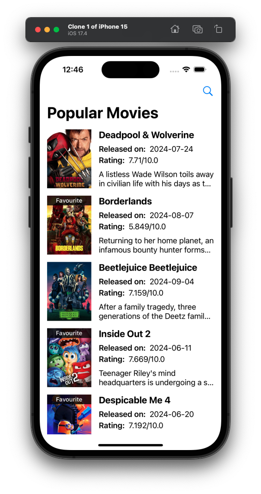
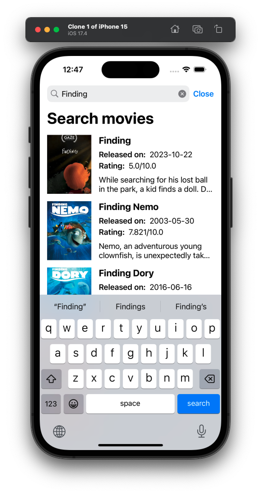
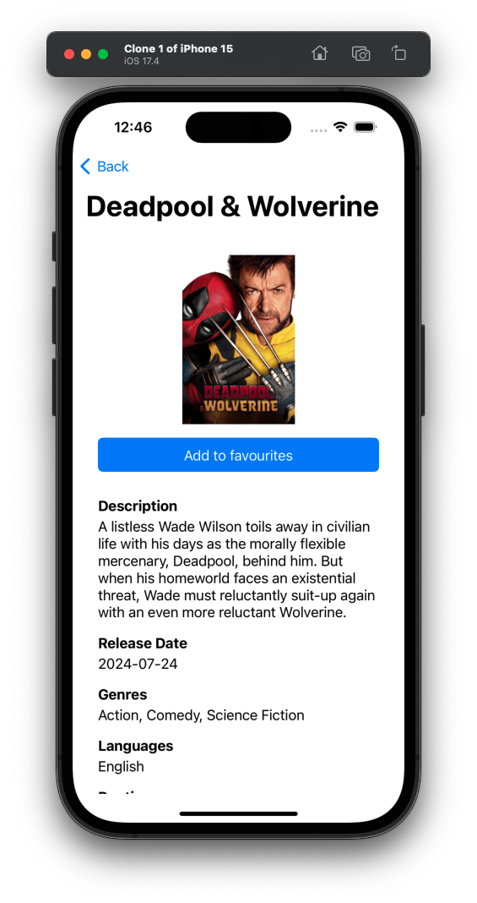

# Movie App
## Overview
A demonstration of building a simple List-Detail app using AutoLayout and UIKit, following a straightforward MVC architecture.

## Screenshots

| Home Screen | Search Screen | Movie Details |
|-------------|---------------|---------------|
|  |  |  |

## Installation and Running the App
This project is dependency-free, making the setup process straightforward. To run the app:

- Clone the repository.
- Open the project in Xcode.
- Build and run the project.

No additional setup is required.

## Backend APIs
The app leverages TMDB APIs to fetch movie data. The API keys are embedded within the project, though they are part of a free tier account, which includes rate limiting. You can replace the API keys in the Server class if needed:

```swift
class Server {
    static let baseUrl: String = "https://api.themoviedb.org"
    static let apiKey: String = "REPLACE WITH YOUR API KEY"
    static let readAccessToken: String = "REPLACE WITH YOUR ACCESS TOKEN"
}
```
## Features
- Popular Movies List: The app launches by displaying a list of popular movies, with support for pagination, pull-to-refresh, and error handling.
- Search Functionality: Access the search screen by tapping the magnifying glass icon in the top-right corner.
- Movie Details: Tap on any movie in the Home or Search screens to view detailed information. You can also add movies to your favorite collection from the detail view.
